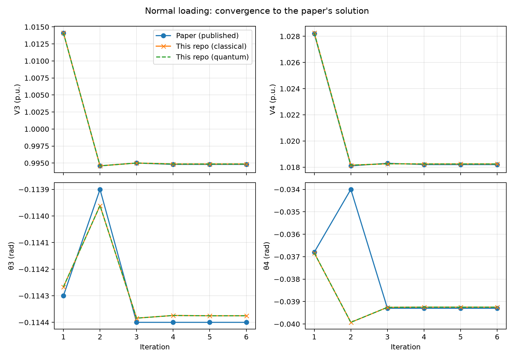
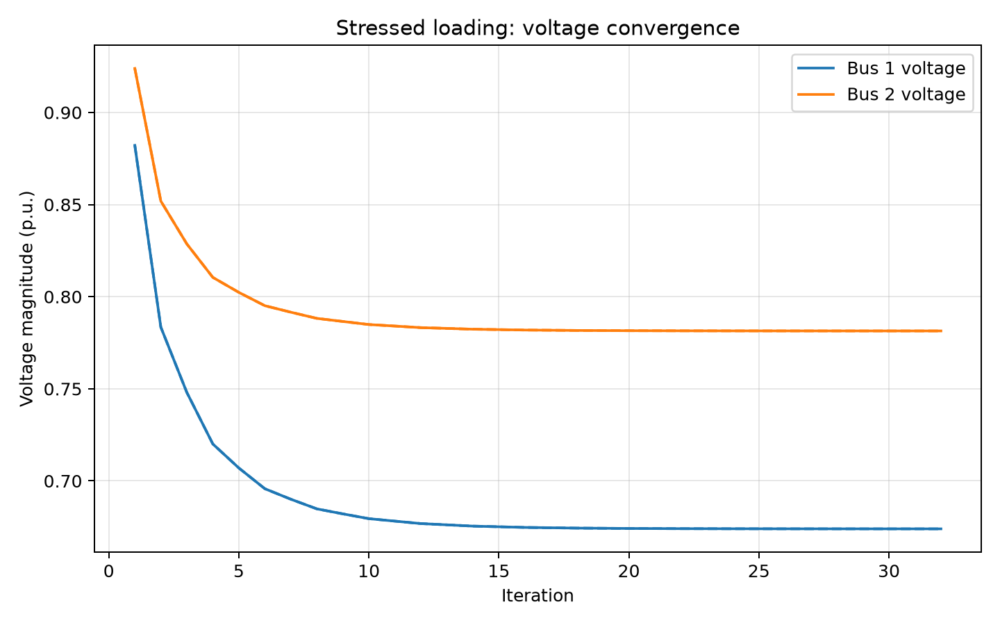
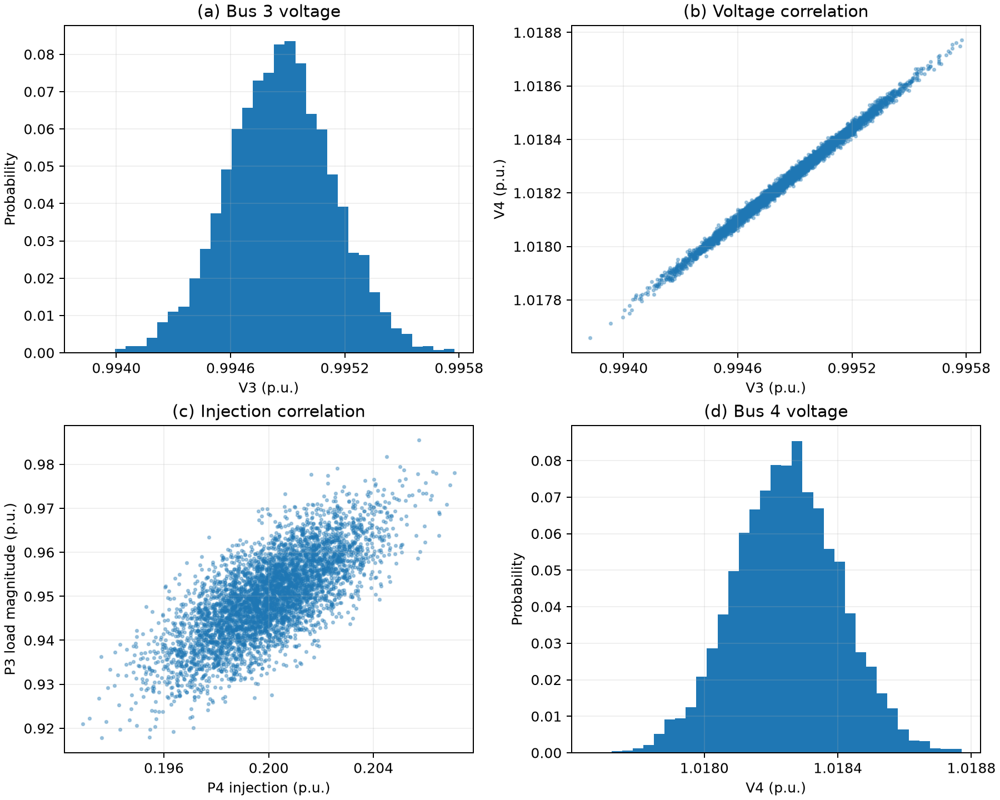
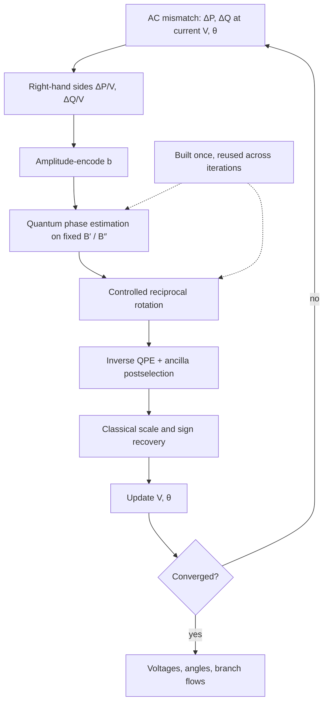

# Quantum Power Flow: a HHL-based implementation

[](https://github.com/TravisCao/quantum-power-flow/actions/workflows/ci.yml)
[](https://www.python.org/)
[](https://www.ibm.com/quantum/qiskit)
[](LICENSE)
[](docs/reconstruction_notes.md)

A transparent, end-to-end reproduction of the five-bus Quantum Power Flow (QPF) study by Feng, Zhou, and Zhang, implemented with modern Qiskit and Qiskit Aer.

> F. Feng, Y. Zhou, and P. Zhang, “Quantum Power Flow,” arXiv:2104.04888, 2021.

The repository reconstructs the paper’s fast-decoupled AC power-flow model, implements a custom Harrow–Hassidim–Lloyd (HHL) circuit, and reproduces every reported experiment: the normal and stressed operating cases, the finite phase-register precision ablation, and the 5,000-sample correlated stochastic power-flow study. Every assumption, inferred parameter, and numerical discrepancy relative to the paper is documented.

## Results

Everything in this section is regenerated end-to-end by one command, `qpf-reproduce all` (see [Quickstart](#quickstart)).



*Normal loading (the paper’s Test I): this repo’s quantum and classical solvers both track the paper’s published iteration history.*



*Stressed loading (the paper’s Test II): solid lines are this repo’s classical solver, dashed lines the quantum solver; both converge to the same endpoint near the solvability boundary. This reproduction converges in 32 updates where the paper reports 34; the difference is analyzed in [`docs/reconstruction_notes.md`](docs/reconstruction_notes.md).*



*5,000 random loading scenarios with correlated Gaussian injections (the paper’s stochastic experiment), solved with the quantum solver.*

| Experiment | Reproduced result | Paper reference / interpretation |
|---|---:|---|
| Normal case (paper Test I): final voltage at bus 3 | `0.99485952` p.u. | Matches the printed value `0.9948` |
| Normal case (paper Test I): final voltage at bus 4 | `1.01824660` p.u. | Matches the printed value `1.0182` |
| Normal case (paper Test I): final angle at bus 3 | `-0.11437525` rad | Matches the printed value `-0.1144` |
| Normal case (paper Test I): final angle at bus 4 | `-0.03924776` rad | Matches the printed value `-0.0393` |
| HHL linear solve: agreement with direct solve | `< 1e-13` | Statevector simulation, four phase qubits; exact value is platform-dependent floating-point noise |
| Quantum vs classical trajectory difference | `< 1e-14` | Numerically identical within floating-point noise; exact value is platform-dependent |
| Stressed case (paper Test II): convergence | 32 updates | Paper reports 34; endpoints agree with the plotted curves |
| Stochastic experiment: samples converged | `5000 / 5000` | Correlated Gaussian injections, correlation target `0.75` |
| Representative HHL circuit: logical qubits | 7 | 4 phase + 2 system + 1 ancilla |

Machine-readable metrics are in [`results/diagnostics/reproduction_metrics.json`](results/diagnostics/reproduction_metrics.json). Assumptions, reconstructed parameters, and every difference from the paper: [`docs/reconstruction_notes.md`](docs/reconstruction_notes.md) and [`docs/limitations_and_interpretation.md`](docs/limitations_and_interpretation.md).

## Method in brief

Each fast-decoupled iteration writes the state update as two constant-matrix linear systems, `B′(VΔθ) = ΔP/V` and `B″ΔV = ΔQ/V`, and hands them to a custom HHL solver. The reduced matrices are iteration-independent, so the expensive circuit parts, phase estimation and the reciprocal rotation, are built once and reused across iterations.



Equation-by-equation map from the paper to the code: [`docs/algorithm_mapping.md`](docs/algorithm_mapping.md).

## Quickstart

Python 3.10–3.13 is supported. The archived reproduction used Python 3.13.5, Qiskit 2.5.0, and Qiskit Aer 0.17.2.

```bash
git clone https://github.com/TravisCao/quantum-power-flow.git
cd quantum-power-flow

python -m venv .venv
source .venv/bin/activate                 # Windows: .venv\Scripts\activate
python -m pip install --upgrade pip
python -m pip install -e '.[dev]'
```

Reproduce every experiment (deterministic, stressed, precision-ablation, and stochastic) and write figures, tables, and diagnostics under `results/`:

```bash
qpf-reproduce all --output results
```

Equivalent script entry point: `python scripts/reproduce_all.py`. The omitted-line-parameter inference can be repeated independently with `python scripts/infer_missing_line_data.py`.

Run the verification suite:

```bash
ruff check src tests scripts
pytest -q
```

## Configuration

The primary assumptions are exposed in [`configs/paper_case5.yaml`](configs/paper_case5.yaml), including:

- five-bus topology and bus injections;
- slack-bus voltage;
- reconstructed common branch impedance;
- convergence tolerance;
- four-qubit phase register and phase scale;
- stochastic sample count, seed, target correlation, and marginal standard deviation.

The stressed operating case is defined separately in [`configs/stressed_case5.yaml`](configs/stressed_case5.yaml).

## Repository structure

```text
quantum-power-flow/
├── configs/                  # Normal and stressed five-bus cases
├── docs/                     # Algorithm mapping, reconstruction, limitations
├── notebooks/                # Guided paper-reproduction notebook
├── paper/                    # Citation and links to the original article
├── results/
│   ├── diagnostics/          # Circuit statistics and machine-readable metrics
│   ├── figures/              # Reproduced plots (committed; regenerated by the CLI)
│   └── tables/               # Iteration traces and Monte Carlo samples
├── scripts/                  # Reproduction and parameter-inference entry points
├── src/qpf_repro/
│   ├── quantum/hhl.py        # Custom modern-Qiskit HHL implementation
│   ├── powerflow.py          # Fast-decoupled and Newton–Raphson solvers
│   ├── network.py            # Y-bus, injections, line flows, B′/B″ matrices
│   ├── stochastic.py         # Correlated stochastic power flow
│   └── experiments/          # End-to-end paper experiment runner
└── tests/                    # Physics, circuit, and regression tests
```

## Notebook

[`notebooks/reproduce_paper.ipynb`](notebooks/reproduce_paper.ipynb) is a guided lab designed for students without prior quantum-computing or linear-algebra experience: the five-bus application, classical and HHL-simulation comparisons, demand and quantum-precision controls, and the constructed Qiskit circuit.

```bash
uv pip install --python .venv/bin/python -e '.[notebook]'
.venv/bin/jupyter lab notebooks/reproduce_paper.ipynb
```

## Contributing

Reproduction corrections, numerical cross-checks, and alternative quantum linear-system backends are welcome. Please read [`CONTRIBUTING.md`](CONTRIBUTING.md) before opening a pull request.

## License

The implementation is released under the [MIT License](LICENSE). The original paper remains subject to its authors’ and publisher’s terms; its PDF is linked rather than redistributed.
